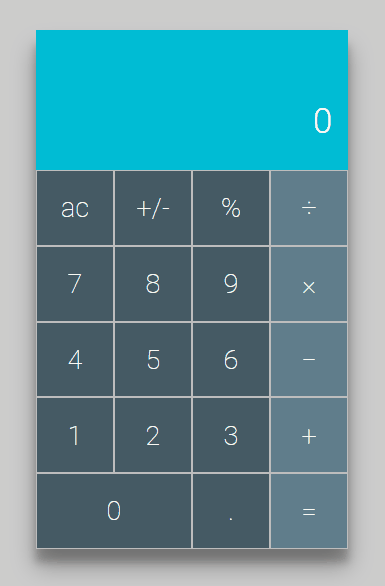
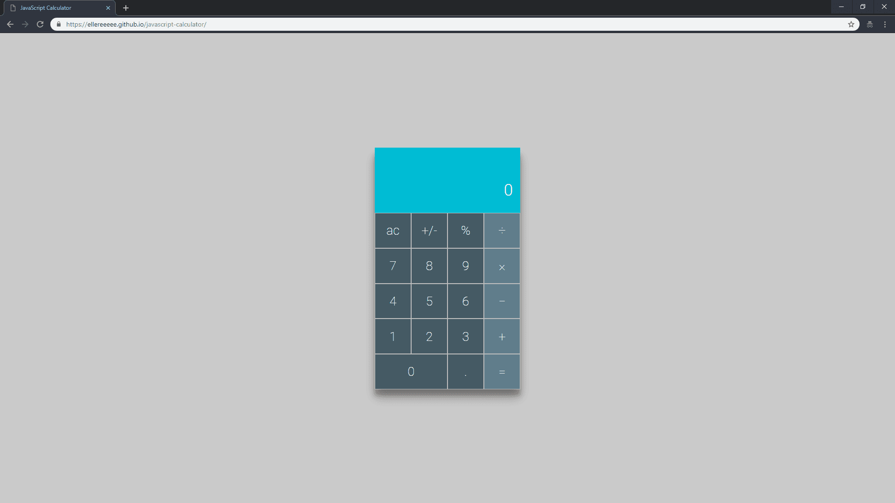

## JavaScript Calculator

This is a calculator web application.

Check it out 👉[here](https://ellereeeee.github.io/javascript-calculator/).

## Motivation

I created this for the freeCodeCamp [JavaScript calculator assignment](https://learn.freecodecamp.org/front-end-libraries/front-end-libraries-projects/build-a-javascript-calculator/).

## Screenshots

## Tech Used

- JavaScript
- jQuery
- Git